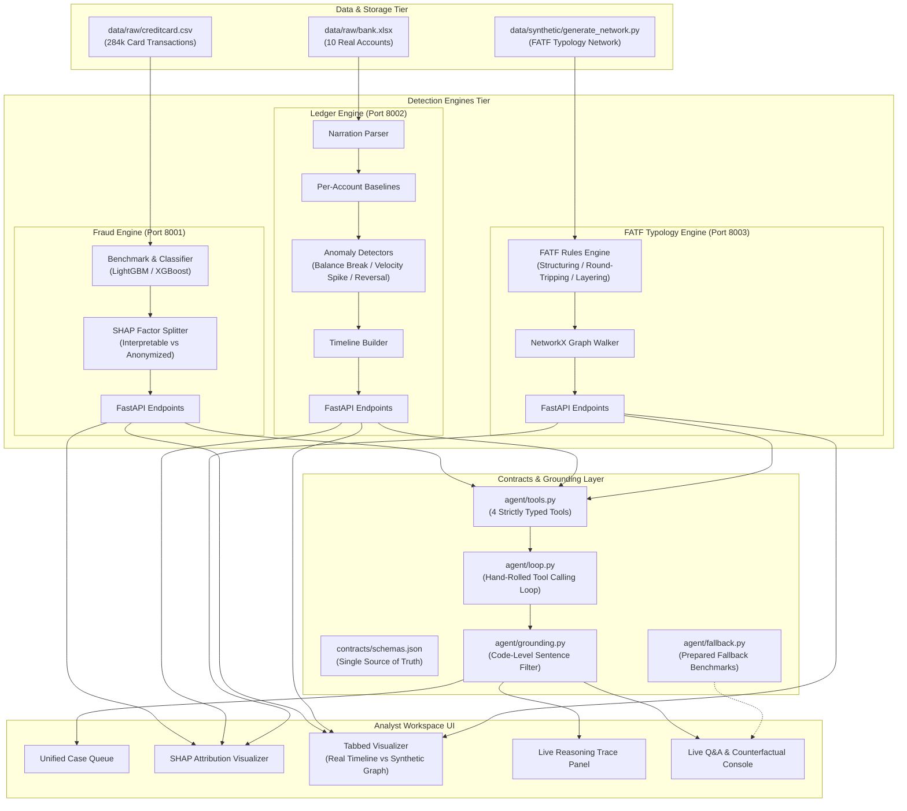
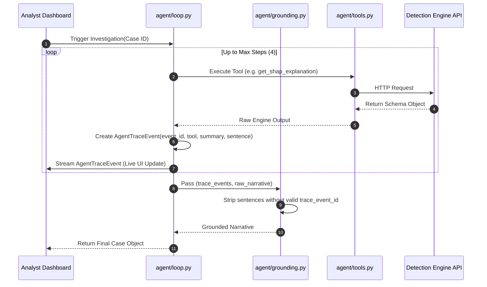

# System Architecture & Technical Design — Verity

## 1. System Overview

Verity is engineered around a **contract-first, dual-engine, grounded-agent** architecture. It ingests both transactional card streams and multi-account ledger data, analyzes them via specialized ML and statistical engines, and exposes a unified investigative workflow through a strictly grounded agent loop and analyst dashboard.



---

## 2. Core Architectural Principles

### 2.1 Contract-First Architecture
All communications between detection engines, agent tools, and frontend views adhere to JSON schemas defined in [`contracts/schemas.json`](file:///c:/Users/harsh/Desktop/Web%20Dev/Verity/contracts/schemas.json):
* `TransactionRecord`
* `FraudExplanation`
* `ReconciliationAnomaly`
* `GraphWalkStep`
* `TypologyFlag`
* `AgentTraceEvent`
* `Case`

### 2.2 Dual Detection Engines

#### 1. Fraud Detection Engine (`engines/fraud/`)
* **Objective:** Real-time scoring of individual credit card transactions.
* **Imbalance Handling:** Compares SMOTE with cost-sensitive class weighting (`scale_pos_weight` / balanced priors) on heavily skewed labels (~0.17% fraud rate).
* **Explainability Pipeline:** Computes TreeSHAP attributions per instance and groups factors into:
  $$\text{Interpretable} = \{\text{Amount}, \text{Time}\}$$
  $$\text{Anonymized Signals} = \{V_1, V_2, \dots, V_{28}\}$$
* **API Endpoints:**
  * `GET /api/v1/fraud/transaction/{transaction_id}`
  * `GET /api/v1/fraud/explain/{transaction_id}`

#### 2. Account Ledger Engine (`engines/ledger/`)
* **Objective:** Analyze running balances, velocity, and reversals across 10 real bank accounts without fabricating cross-party networks.
* **Feature Extraction:** Parses unstructured narration strings (extracting payment rail: RTGS, NEFT, UPI, CHQ, POS).
* **Anomaly Detection Algorithms:**
  1. **Balance Break:** Flags when balance falls below historical confidence bands:
     $$\text{Balance}_t < \mu_{\text{balance}} - 3\sigma_{\text{balance}}$$
  2. **Timing / Velocity Spike:** Computes rolling 24h/48h transaction frequency relative to 30-day baseline:
     $$\text{Velocity}_{24h} > 3 \times \overline{\text{Velocity}}$$
  3. **Reversal Outlier:** Identifies disproportionate credit/debit cancel sequences.
* **Timeline Generator:** Formats transaction sequences into horizontal time strips for dense visual representation.

#### 3. FATF Typology Engine (`engines/typology/`)
* **Objective:** Detect structured laundering behaviors over multi-account synthetic graphs.
* **Graph Engine:** NetworkX directed multigraph $G = (V, E, W)$.
* **Typology Detectors:**
  * **Structuring:** Multiple sub-threshold transactions from disparate nodes into a collector node within $\Delta t < 24\text{h}$.
  * **Round-Tripping:** Directed cycle detection $u \to v \to w \to u$ preserving $\ge 85\%$ volume.
  * **Rapid Layering:** Long paths of high-velocity transactions ($|\text{hops}| \ge 3$, inter-hop latency $< 2\text{h}$).

---

## 3. Agent Grounding & Reasoning Engine

### 3.1 Hand-Rolled Tool Loop
Unlike black-box autonomous frameworks (LangChain/CrewAI), Verity uses a deterministic, transparent loop in `agent/loop.py`:



### 3.2 Code-Level Grounding Filter (`agent/grounding.py`)
To eliminate LLM hallucinations:
* The LLM is **never allowed** to output arbitrary free-form narratives directly to the UI.
* Every declarative statement must be explicitly linked to an `event_id` emitted by a real tool execution.
* Any unverified claims are stripped at the Python code level before serializing the `Case` object.

---

## 4. UI Architecture & Visualization

* **Unified Triage Queue:** Aggregates card fraud and ledger alerts into a single sorted desk queue.
* **Real Ledger Timeline View:** Resolves the sparse-data problem by rendering each account as a horizontal interactive timeline with highlighted anomaly bounding boxes.
* **Synthetic Typology Graph View:** Renders node-edge network graphs with colored paths for detected FATF typologies.
* **Live Trace Panel:** Renders incoming `AgentTraceEvent`s sequentially with step icons, latency counters, and input/output summaries.
* **Interactive Chat Console:** Analyst can query reasons, request counterfactual recalculations, or explore similar cases.

---

## 5. Directory Structure & Component Mapping

```
Verity/
├── contracts/
│   ├── schemas.json             # Canonical JSON Schema definitions
│   └── mock_data/               # Mock data fixtures for UI and test harness
├── data/
│   ├── raw/                     # Raw datasets (gitignored)
│   └── synthetic/               # FATF synthetic graph generation scripts
├── engines/
│   ├── fraud/                   # Card fraud modeling, SHAP explainers & API
│   ├── ledger/                  # Bank ledger parser, baseline reconciler & API
│   └── typology/                # FATF rules, graph walk & API
├── agent/
│   ├── tools.py                 # Strictly typed tool wrappers
│   ├── loop.py                  # Step-by-step tool loop
│   ├── grounding.py             # Code-level trace event citation filter
│   └── fallback.py              # Pre-cached fallback answer dispatcher
├── dashboard/                   # Analyst cockpit UI modules
├── docs/                        # Architecture, PRD, Guides, Pitch & Demo Scripts
├── requirements.txt             # Python environment dependencies
└── VERITY_BUILD_SPEC.md         # Master build specification
```
