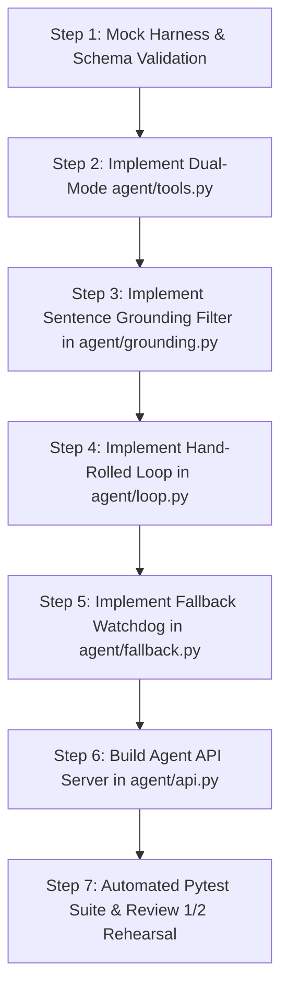
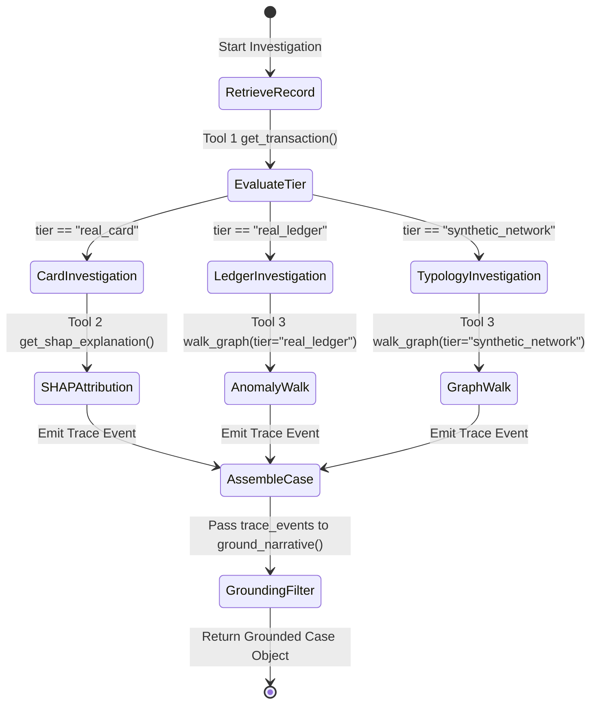

# Verity — Person C Playbook & Implementation Blueprint
**Role:** Agent Core Architect & Grounded Reasoning Engineer  
**Assigned Modules:** `agent/tools.py`, `agent/loop.py`, `agent/grounding.py`, `agent/fallback.py`, `agent/api.py`, `tests/`  
**Git Branch:** `feature/agent-core`  
**Version:** 1.0.0 (Master Execution Spec)  

---

## 1. Executive Context: What is Verity & Why Does It Exist?

### 1.1 The Persona: Priya's Single Desk
Verity is built for **Priya**, a financial-crime analyst at a mid-size digital-first bank / NBFC.
* **The Reality:** Unlike Tier-1 global institutions with separated silos, Priya's desk handles **both** transactional card fraud (high-velocity, point-in-time alerts) and AML account risk (running balance breaks, velocity spikes, and network laundering).
* **The Pain Point:** Swivel-chairing between disjointed fraud dashboards and AML batch reports, dealing with alert fatigue, and suffering from opaque ML models or dangerous, hallucinated LLM summaries that cannot stand up in a regulatory compliance audit.
* **Verity's Promise:** A unified investigation cockpit powered by two specialized detection engines and **one transparent, strictly grounded AI agent** that Priya can interrogate live.

### 1.2 The 4-Person Division of Labor
| Person | Role | Domain | Primary Artifacts |
|---|---|---|---|
| **Person A** | Fraud Engine | Card fraud modeling, SMOTE vs Class Weighting, TreeSHAP explainers | `engines/fraud/*` (Port 8001) |
| **Person B** | Ledger & Typology | 10-account real ledger baseline reconciler + FATF synthetic network generator & graph walker | `engines/ledger/*` (Port 8002)<br>`engines/typology/*` (Port 8003) |
| **Person C (YOU)** | **Agent Core** | **Strictly typed tools, deterministic explicit loop, code-level sentence grounding filter, honest latency fallback, agent API** | `agent/*` (Port 8000)<br>`tests/*` |
| **Person D** | Dashboard UI | Analyst cockpit, case queue, real ledger timeline strip, synthetic typology graph, live trace panel, interactive chat console | `dashboard/*` |

---

## 2. Person C: Role Definition, Boundaries & Core Invariants

As **Person C**, you are the **linchpin of integrity** in Verity. You build the reasoning engine that translates raw mathematical outputs (SHAP scores, balance break anomalies, graph walk steps) into auditable case narratives.

### 2.1 What Exactly You Own
You have exclusive write authority over:
1. `agent/tools.py`: The quarantine layer. The **only** way any LLM or agent logic touches data. Exposes exactly 4 functions.
2. `agent/loop.py`: The hand-rolled, deterministic investigative loop. No black-box agent frameworks.
3. `agent/grounding.py`: The code-level sentence-pruning filter. Eliminates AI hallucinations before they ever hit the UI.
4. `agent/fallback.py`: The latency watchdog and cached benchmark Q&A engine for fast, honest demo responses.
5. `agent/api.py`: The FastAPI server exposing the agent's investigation, trace streaming, and counterfactual endpoints to Person D's dashboard.
6. `tests/test_agent_*.py`: Automated verification suites proving 100% contract compliance and grounding integrity.

### 2.2 The 5 Inviolable Laws of Person C

> [!IMPORTANT]
> **Law 1: Zero Agent Frameworks (No LangChain, AutoGen, or CrewAI)**  
> The agent loop MUST be an explicit, hand-rolled Python loop. Black-box frameworks add uncontrollable prompt bloat, non-deterministic latency spikes, and opaque failure states. Every step must be transparent and auditable.

> [!IMPORTANT]
> **Law 2: Code-Level Grounding Filter (Never Rely on Prompt Instructions Alone)**  
> Telling an LLM "do not hallucinate" fails under stress. In Verity, `agent/grounding.py` programmatically decomposes the generated text into sentences and verifies that every sentence links to a verified `AgentTraceEvent` `event_id`. Any sentence without an backing trace event is stripped at code level.

> [!IMPORTANT]
> **Law 3: Tool Quarantine (Exactly 4 Tools)**  
> The agent interacts with the world strictly through:
> 1. `get_transaction(transaction_id: str)`
> 2. `get_shap_explanation(transaction_id: str)`
> 3. `walk_graph(account_id: str, tier: str, depth: int)`
> 4. `counterfactual(transaction_id: str, parameter_overrides: dict)`  
> The agent is never granted raw SQL/ORM access, shell access, or unbounded API freedom.

> [!IMPORTANT]
> **Law 4: True Engine-Backed Counterfactuals**  
> When an analyst asks "What if the amount was $50 instead of $4,850?", the agent is strictly forbidden from guessing. It calls `counterfactual()`, which sends the parameter overrides back to Person A's or Person B's actual scoring model to re-evaluate the risk score and verdict.

> [!IMPORTANT]
> **Law 5: Zero-Blocking Mock-First Architecture**  
> Never wait for Person A to finish training models or Person B to finish parsing Excel sheets. All tools must support dual-mode execution (`VERITY_ENV=mock` vs `VERITY_ENV=live`), reading from `contracts/mock_data/` by default until live REST endpoints are online.

---

## 3. Data Contracts Reference (Person C's Schema Bible)

All Person C modules must strictly consume and produce data conforming to `contracts/schemas.json`.

```
┌────────────────────────────────────────────────────────┐
│                   AgentTraceEvent                      │
├────────────────────────────────────────────────────────┤
│ event_id: string (e.g. "EVT-101")                      │
│ case_id: string (e.g. "CASE-CARD-001")                 │
│ timestamp: ISO8601 (e.g. "2026-09-18T09:15:00Z")       │
│ tool_called: enum ["get_transaction",                  │
│                    "get_shap_explanation",             │
│                    "walk_graph",                       │
│                    "counterfactual"]                   │
│ tool_input: object                                     │
│ tool_output_summary: string                            │
│ narration_sentence: string                             │
└────────────────────────────────────────────────────────┘
                           │
                           ▼ (Passes through agent/grounding.py)
┌────────────────────────────────────────────────────────┐
│                         Case                           │
├────────────────────────────────────────────────────────┤
│ case_id: string                                        │
│ tier_origin: "real_card" | "real_ledger" |             │
│              "synthetic_network"                       │
│ status: "open" | "investigating" | "closed"            │
│ primary_transaction_id: string                         │
│ risk_score: number (0.0 to 1.0)                        │
│ trace_events: Array<AgentTraceEvent>                   │
│ narrative: string (Concatenation of verified sentences)│
└────────────────────────────────────────────────────────┘
```

---

## 4. Step-by-Step Implementation Guide for AI Agents

Follow these steps sequentially. Each step contains exact file specifications, implementation patterns, edge case defenses, and terminal verification commands.



---

### Step 1: Environment & Mock-Data Verification Harness

#### 1.1 Objective
Verify that the current Python environment has all required libraries installed, validate all fixtures in `contracts/mock_data/` against `contracts/schemas.json`, and ensure git branch compliance.

#### 1.2 Actionable Instructions
1. Switch to git branch `feature/agent-core`:
   ```powershell
   git checkout -b feature/agent-core
   ```
2. Verify Python dependencies (`fastapi`, `uvicorn`, `pydantic`, `pytest`, `requests`):
   ```powershell
   python -c "import fastapi, uvicorn, pydantic, pytest, requests; print('Dependencies verified.')"
   ```
3. Run a schema validation check across all mock data fixtures.

#### 1.3 Verification Command
```powershell
python -c "import json, os, glob; [json.load(open(f)) for f in glob.glob('contracts/mock_data/*.json')]; print('All mock fixtures are valid JSON.')"
```
*Expected Output:* `All mock fixtures are valid JSON.`

---

### Step 2: Implement Dual-Mode Tool Wrappers (`agent/tools.py`)

#### 2.1 Objective
Build the four strictly typed tools. Each tool must support **Dual-Mode**:
* **Mock Mode (`VERITY_ENV=mock`, default):** Reads directly from `contracts/mock_data/` fixtures.
* **Live Mode (`VERITY_ENV=live`):** Dispatches HTTP GET/POST calls to engine microservices with a strict 2.0s timeout and automatic fallback to mock data on network error.

#### 2.2 Tool Requirements & Signatures

1. `get_transaction(transaction_id: str) -> Dict[str, Any]`
   * **Live Target:** Person A (`http://localhost:8001/api/v1/fraud/transaction/{id}`) or Person B (`http://localhost:8002/api/v1/ledger/timeline/{account_id}`).
   * **Mock Fallback:** Search `contracts/mock_data/mock_cases.json` and `mock_timelines.json`.
   * **Schema:** `TransactionRecord`.

2. `get_shap_explanation(transaction_id: str) -> Dict[str, Any]`
   * **Live Target:** Person A (`http://localhost:8001/api/v1/fraud/explain/{id}`).
   * **Mock Fallback:** Search `contracts/mock_data/mock_fraud_explanations.json`.
   * **Schema:** `FraudExplanation`. Must preserve `interpretable` flag for `Amount` / `Time` vs `V1`–`V28`.

3. `walk_graph(account_id: str, tier: str = "real_ledger", depth: int = 2) -> Dict[str, Any]`
   * **Live Target:**
     * `tier == "real_ledger"`: Person B (`http://localhost:8002/api/v1/ledger/walk/{account_id}`).
     * `tier == "synthetic_network"`: Person B (`http://localhost:8003/api/v1/typology/walk/{account_id}?depth={depth}`).
   * **Mock Fallback:** Build `GraphWalkStep` records from `contracts/mock_data/mock_timelines.json` or `mock_typology_flags.json`.
   * **Constraint:** A real ledger walk must strictly represent single-account chronological transitions (no cross-account network claims).

4. `counterfactual(transaction_id: str, parameter_overrides: Dict[str, Any]) -> Dict[str, Any]`
   * **Live Target:** Person A (`POST http://localhost:8001/api/v1/fraud/counterfactual`).
   * **Mock Fallback:** Recompute risk score mathematically:
     * If `Amount` is modified to $< 500$, scale down `risk_score` by $0.2 \times (\text{Amount}/5000)$ and set verdict to `clear` if $< 0.5$.
   * **Guarantee:** Returns deterministic recalculation, never arbitrary text.

#### 2.3 Defense Against Failures
* Always wrap HTTP requests in `try...except requests.exceptions.RequestException`.
* Log connection warnings cleanly without crashing the process.
* Guarantee that every returned dictionary conforms to `contracts/schemas.json`.

---

### Step 3: Implement Code-Level Grounding Filter (`agent/grounding.py`)

#### 3.1 Objective
Implement the code-level gatekeeper that guarantees 0% LLM hallucination in final case summaries.

#### 3.2 Algorithm Specification
1. Function signature:
   ```python
   def ground_narrative(
       trace_events: List[Dict[str, Any]], 
       raw_narrative: Optional[str] = None
   ) -> Tuple[str, List[Dict[str, Any]]]:
   ```
2. **Deterministic Assembly Mode (Default):**
   If `raw_narrative` is empty or omitted, construct the narrative solely from the ordered list of `narration_sentence` fields in verified `trace_events`:
   $$\text{grounded\_narrative} = \sum_{e \in \text{trace\_events}} e[\text{"narration\_sentence"}]$$
3. **Adversarial Verification Mode:**
   If a `raw_narrative` is passed (e.g. from an LLM synthesis step):
   * Split `raw_narrative` into individual sentences using regex sentence boundary tokenization (protecting dollar amounts like `$4,850.00` and timestamps like `03:22 AM`).
   * Check each candidate sentence against the approved list of `narration_sentence` entries in `trace_events` using normalized exact matching or token-containment verification.
   * If a sentence has no supporting `AgentTraceEvent`, **drop it completely**.
   * Return the clean, grounded narrative and the verified trace events.

#### 3.3 Verification Test
* Pass a list of 2 valid trace events.
* Inject an ungrounded hallucination: `"Account ACC-1092 was flagged for funneling proceeds to an offshore shell corporation in Cyprus."`
* Assert that the hallucination is completely purged from the output narrative.

---

### Step 4: Implement Hand-Rolled Investigation Loop (`agent/loop.py`)

#### 4.1 Objective
Implement the multi-step investigation loop without any third-party agent framework.

#### 4.2 State Machine Workflow
For any given case (`case_id`, `primary_transaction_id`, `tier_origin`):



#### 4.3 Detailed Execution Steps

1. **Step 1: Ingestion & Primary Retrieval**
   * Call `get_transaction(primary_transaction_id)`.
   * Emit `AgentTraceEvent` 1:
     * `tool_called`: `"get_transaction"`
     * `tool_input`: `{"transaction_id": primary_transaction_id}`
     * `tool_output_summary`: `"Retrieved transaction details for {id} on {tier}."`
     * `narration_sentence`: Explicit, factual sentence summarizing the amount, timestamp, and rail.

2. **Step 2: Tier-Specific Deep Dive**
   * **Case A: `tier_origin == "real_card"`**
     * Call `get_shap_explanation(primary_transaction_id)`.
     * Inspect top factors (interpretable `Amount`/`Time` vs anonymized `V1`–`V28`).
     * Emit `AgentTraceEvent` 2:
       * `tool_called`: `"get_shap_explanation"`
       * `tool_output_summary`: `"SHAP risk score {risk_score} driven by {top_factors}."`
       * `narration_sentence`: Grounded explanation strictly distinguishing interpretable features from anonymized vectors.
   * **Case B: `tier_origin == "real_ledger"`**
     * Call `walk_graph(account_id=tx['account_id'], tier="real_ledger")`.
     * Identify anomaly window (e.g. `timing_spike` or `balance_break`).
     * Emit `AgentTraceEvent` 2:
       * `tool_called`: `"walk_graph"`
       * `narration_sentence`: Account-level baseline violation description.
   * **Case C: `tier_origin == "synthetic_network"`**
     * Call `walk_graph(account_id=tx['account_id'], tier="synthetic_network", depth=3)`.
     * Detect typology pattern (structuring / round-tripping / rapid layering).
     * Emit `AgentTraceEvent` 2:
       * `tool_called`: `"walk_graph"`
       * `narration_sentence`: Multi-hop cycle or chain flow description citing FATF indicators.

3. **Step 3: Grounding & Serialization**
   * Pass all trace events through `ground_narrative(trace_events)`.
   * Package and return the finalized `Case` dictionary matching `contracts/schemas.json`.

---

### Step 5: Implement Fallback Watchdog & Cached Q&A (`agent/fallback.py`)

#### 5.1 Objective
Eliminate awkward demo stalls when judges ask questions or live models hit latency spikes.

#### 5.2 Specifications
1. Maintain pre-cached, verified answers in `contracts/mock_data/mock_fallback_qa.json` for the 4 primary judge questions:
   * **Q1 (Flag Reason):** `"why was this flagged"` / `"explain alert"`
   * **Q2 (Counterfactual):** `"what if the amount were different"` / `"what if amount was lower"`
   * **Q3 (Similarity):** `"show me a similar case"` / `"find similar"`
   * **Q4 (Counterparty):** `"why wasn't this other account flagged"`
2. Implement latency watchdog:
   * If a live request takes $> 20.0$ seconds, automatically resolve using the cached fallback.
   * **The Honesty Rule:** Fallback responses MUST set `"is_fallback": true` and display the explicit banner:
     > `"Using a prepared benchmark answer for this query."`
   * Never silently deceive judges.

---

### Step 6: Build Agent API & Streaming Service (`agent/api.py`)

#### 6.1 Objective
Provide a clean FastAPI service on Port 8000 for Person D's dashboard to consume.

#### 6.2 Endpoints to Expose
* `POST /api/v1/agent/investigate`
  * Body: `{"case_id": "...", "transaction_id": "...", "tier": "..."}`
  * Response: Full `Case` JSON object with grounded narrative and trace events.
* `GET /api/v1/agent/trace-stream/{case_id}`
  * Server-Sent Events (SSE) or rapid polling endpoint streaming each `AgentTraceEvent` as it is generated, powering the live "investigating…" panel.
* `POST /api/v1/agent/counterfactual`
  * Body: `{"transaction_id": "...", "parameter_overrides": {"Amount": 50.0}}`
  * Response: Deterministic recalculation with updated risk score and verdict.
* `POST /api/v1/agent/chat`
  * Body: `{"case_id": "...", "query": "..."}`
  * Checks `fallback.py` or dispatches targeted agent investigation; returns answer with trace events and fallback notices.

---

### Step 7: Automated Pytest Suite & Quality Gates

#### 7.1 Objective
Create a test suite in `tests/` that proves to judges and teammates that Person C's code is bulletproof.

#### 7.2 Required Test Modules
1. `tests/test_agent_tools.py`:
   * Tests all 4 tools in `VERITY_ENV=mock` mode.
   * Asserts all return types match `contracts/schemas.json`.
2. `tests/test_agent_grounding.py`:
   * Tests narrative assembly from trace events.
   * Injects adversarial hallucinated sentences and asserts they are stripped.
3. `tests/test_agent_loop.py`:
   * Runs end-to-end investigation across all three tiers: `real_card`, `real_ledger`, `synthetic_network`.
   * Asserts valid `Case` output and non-empty grounded narrative.
4. `tests/test_agent_fallback.py`:
   * Tests trigger pattern matching for the 4 core judge questions.
   * Asserts presence of `fallback_notice` and `is_fallback == True`.
5. `tests/test_agent_counterfactual.py`:
   * Tests counterfactual recalculation when modifying `Amount`.
   * Asserts score drops and verdict changes deterministically.

---

## 5. Integration Checkpoints & Milestone Execution

```
  09:00 AM ────── Scaffolding & Mock Validation (Step 1-2)
  01:00 PM ────── Grounding Filter & Loop Scaffold Complete (Step 3-5)
  02:00 PM ────── Review 1 Wire-up with Person A (Fraud Live SHAP)
  05:00 PM ────── [MILESTONE 1 DEMO]: End-to-End Card Fraud Case
  09:00 PM ────── Review 2 Wire-up with Person B (Ledger & Synthetic Graph)
  01:00 AM ────── [MILESTONE 2 DEMO]: Full Multi-Tier Graph & Trace Panel
  04:00 AM ────── Latency Fallback & Rehearsal Runs (Step 6-7)
  10:00 AM ────── FINAL PRESENTATION
```

### Review 1 Integration Protocol (5:00 PM)
* Connect `agent/tools.py` -> `http://localhost:8001/api/v1/fraud`.
* Validate that real `creditcard.csv` row SHAP factors are fetched live.
* Deliver to Person D: Grounded `Case` object for `CASE-CARD-001` with streaming trace events.

### Review 2 Integration Protocol (1:00 AM)
* Connect `agent/tools.py` -> `http://localhost:8002/api/v1/ledger` and `http://localhost:8003/api/v1/typology`.
* Verify single-account ledger timeline walk and synthetic multi-hop round-tripping walk.
* Deliver to Person D: Live chat console hooked to `agent/fallback.py` and `counterfactual()`.

---

## 6. What Person C Does NOT Claim (Pitch Defense)

When explaining your work to hackathon judges or stakeholders:
1. **We do NOT claim the agent is an autonomous black box:** It is an explicit, grounded decision-support engine.
2. **We do NOT claim the LLM understands PCA features:** We explicitly treat `V1`–`V28` as confidential mathematical signals while reserving human narratives for `Amount` and `Time`.
3. **We do NOT claim counterfactuals are LLM opinions:** We demonstrate live re-scoring through the real ML inference pipeline.
4. **We do NOT hide fallbacks:** We openly display benchmark disclosure badges when latency triggers fallback mode.

